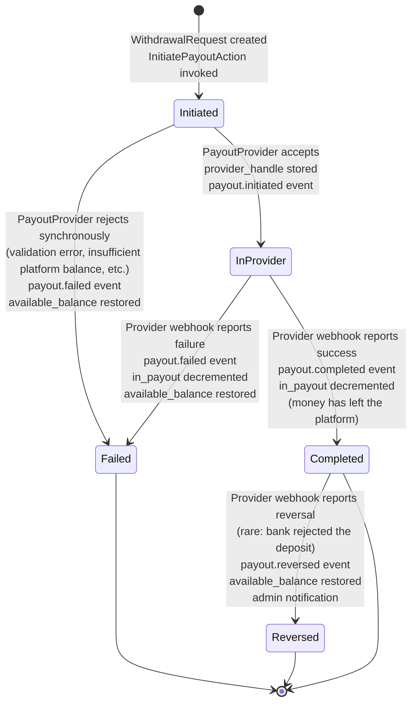
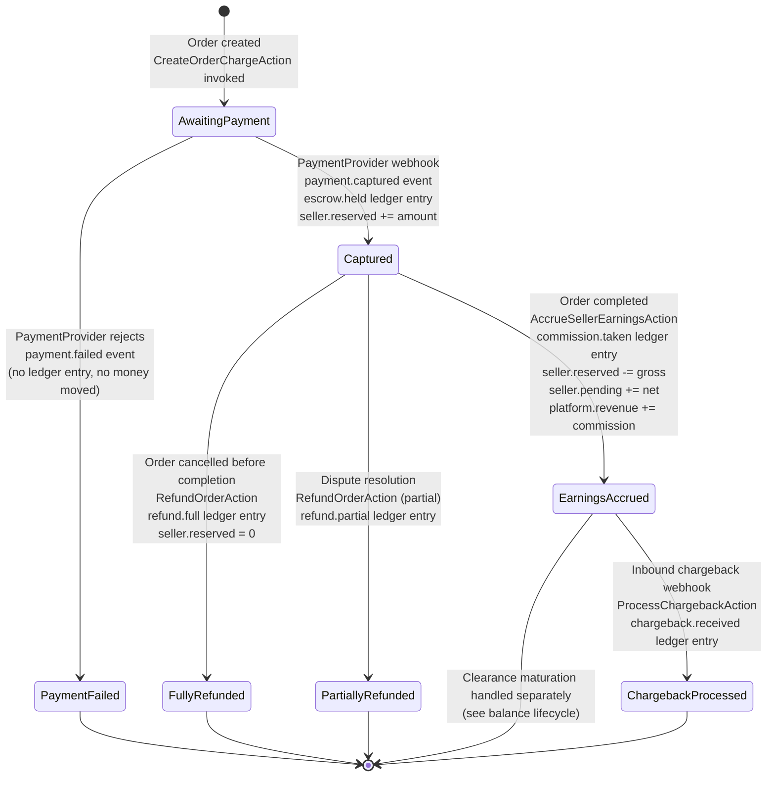
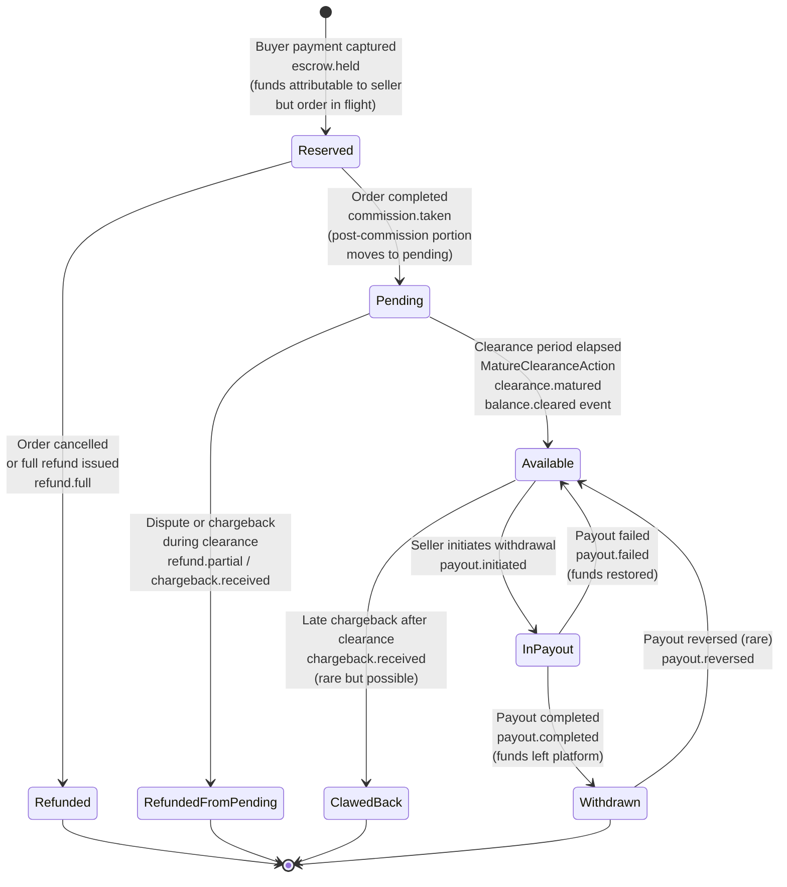
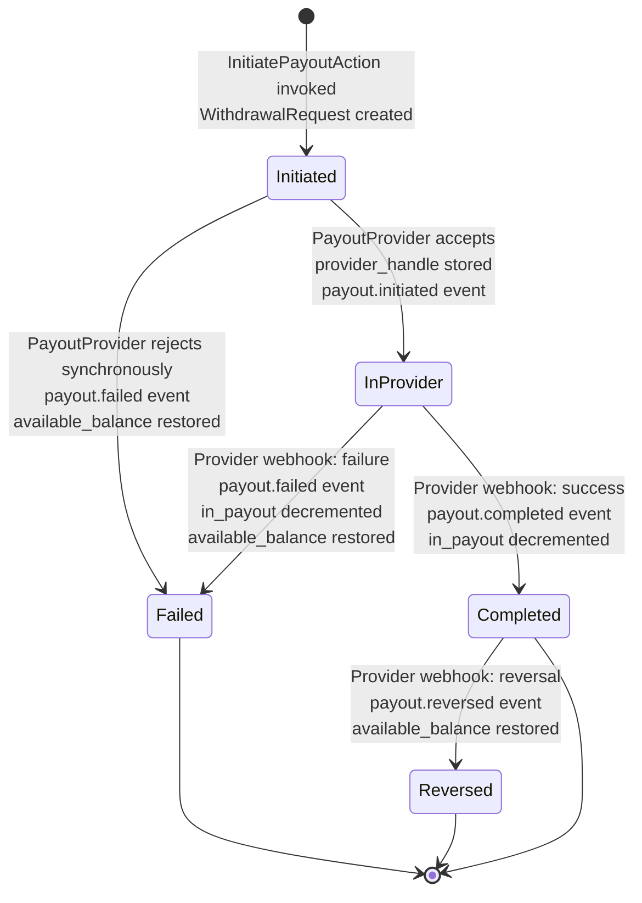

# Financial Architecture Specification

**Document type:** Production-grade engineering specification
**Scope:** Financial subsystem only — money flow, ledger, payments, payouts, balances, refunds, disputes, financial events, financial extensibility
**Status:** v1 architectural baseline. Implementation reference for CORE financial modules.
**Audience:** Senior engineers, financial-domain implementers, plugin authors targeting the financial extension surface.

---

## 0. Reading guide

This document specifies the financial subsystem of a service marketplace platform. It does not describe non-financial concerns (catalog, messaging, search, notifications-as-a-system, admin UI, frontend) except where they intersect with money flow.

Sections are ordered to be read top-to-bottom on first reading. The early sections establish the philosophical constraints and the data-shape commitments; the middle sections specify contracts, state machines, and the ledger; the later sections cover operational concerns (cron, reconciliation, plugin readiness). Mermaid diagrams accompany every state machine and the major flows.

Throughout this document, **CORE** refers to the v1 platform kernel that ships as the licensed product. **Plugin** refers to a separately-loaded extension package that may be authored by the platform vendor or by third parties. The financial subsystem is among the most plugin-extended areas of the platform, and the architectural decisions in this document are designed accordingly.

---

## 1. Foundational principle

The entire financial subsystem is designed against a single rule:

> **CORE is responsible for data shapes and extension seams. Plugins are responsible for policies and orchestration.**

This rule is the spine of every architectural decision in this document. When in doubt about whether a concern belongs in CORE or in a plugin, this rule is the tiebreaker. Its consequences are far-reaching enough to warrant explicit definition.

**Data shapes** are the canonical representations of financial state: the ledger schema, the balance states, the state-machine state names and transitions, the DTOs that flow between Actions, the event payload structures. CORE owns these because plugins must agree on them to interoperate. A plugin that wants to know about completed payouts must read a `payout.completed` event whose payload shape is defined and stable. A plugin that wants to add a new ledger transaction type must register against a transaction registry whose contract is defined and stable. Data shapes are the lingua franca of the financial subsystem and must therefore be the most carefully designed and the most stable surface CORE exposes.

**Extension seams** are the architectural attachment points that allow a plugin to participate without modifying CORE code. These include: the provider contracts (`PaymentProvider`, `PayoutProvider`, etc.), the domain events that fire at every state transition, the `metadata` JSON columns on financial tables that allow plugins to attach data without schema migrations, the settings registry that allows plugins to publish their own settings groups, and the Filament resource registration API that allows plugin admin UIs to coexist with CORE admin UIs. Seams are deliberate; they are documented, versioned, and treated as public API.

**Policies** are the rules that decide what happens. *When* should an auto-payout fire? *Which* tier should a seller be promoted to? *How* should a payout be split across providers? *What* fraud signals warrant a hold? CORE has no opinion on these questions in v1. Each is owned by a plugin (or by the human operator via admin UI) because the right answer varies by jurisdiction, by operator risk tolerance, and by business model. Forcing CORE to take a policy position would either lock operators into a single answer or produce a configuration surface so broad it constitutes a policy engine — which is itself a plugin concern.

**Orchestration** is the coordination of multi-step processes that span time. Schedulers, batchers, retry queues, multi-leg routing, automation rules. CORE provides the *primitives* (the Actions, the events, the state machines) but does not provide the *orchestration* of those primitives toward a higher-level goal. Auto-payouts are orchestration. Tranche batching is orchestration. AI-assisted routing is orchestration. None of it lives in CORE.

The discipline this principle imposes is asymmetric. Adding a data shape or a seam to CORE later is *expensive* — it requires schema migrations, plugin-compatibility considerations, possibly versioned event payloads. Adding a policy or orchestration layer later is *cheap* — it is just a new plugin. Therefore CORE must err on the side of completeness for data shapes and seams (within the calibration discussed in §3) and on the side of austerity for policies and orchestration.

A useful test, when reviewing whether a proposed feature belongs in CORE: if the feature were removed from CORE and reimplemented as a plugin, would the rest of CORE require any modification? If yes, the feature is a data shape or a seam and likely belongs in CORE. If no, the feature is a policy or an orchestration layer and almost certainly belongs in a plugin.

---

## 2. Scope of the financial subsystem

The financial subsystem owns every code path that touches money. Concretely:

- The **ledger** — the append-only record of every financial event in the platform.
- The **balance** model — how seller earnings are represented across the four states.
- The **payment** subsystem — buyer-side checkout, charge capture, refund handling, chargeback processing.
- The **payout** subsystem — seller-initiated withdrawals from available balance to external accounts.
- The **escrow** lifecycle — the conceptual holding of funds between charge and either payout or refund.
- The **clearance** mechanism — the time-based maturation of pending balance into available balance.
- The **dispute and refund** financial flows — the money-side consequences of order cancellations, partial refunds, and chargebacks.
- The **provider abstractions** — the contracts that allow Stripe, PayPal, and future providers to coexist behind unified Actions.
- The **financial state machines** — formal definitions of the legal transitions for orders (payment-side), withdrawals, and refunds.
- The **financial events** — the domain event catalog that allows plugins to observe and react to financial state changes.
- The **financial cron jobs** — scheduled tasks that run on the platform's host (cron-driven, shared-hosting compatible).
- The **reconciliation** model — how internal ledger state is verified against external provider records.

The subsystem does **not** own:

- Order business logic beyond its financial side effects (the order's `delivered`, `accepted`, `cancelled` semantics live in the orders module; the financial consequences of those transitions are routed through the financial subsystem via events and Actions).
- Seller level promotion logic (a Levels plugin's concern).
- Auto-payout policy (a future Auto-Payouts plugin's concern).
- Tax calculation and tax-form generation (a future Tax plugin's concern, though CORE provides the ledger data such a plugin would consume).
- KYC/identity verification (a future KYC plugin's concern, though CORE provides the per-seller flag indicating whether KYC is complete for any given provider).
- Currency conversion / FX (single-currency in v1; a future Multi-Currency plugin will introduce conversion semantics).
- Financial reporting beyond the basic ledger and the admin reconciliation view (richer reporting is a future Analytics plugin's concern).

This delineation is enforced both by module boundaries (financial code lives in `modules/payments`, `modules/payouts`, `modules/ledger` and does not reach into other modules' internals) and by the rule that *all* cross-module communication about money goes through events or through Actions invoked with DTOs.

---

## 3. Calibrated abstraction

The phrase "design for future plugins" admits two interpretations, and the distinction is consequential enough to formalize.

**Premature abstraction** is the practice of introducing an interface for every concept that *might* one day have multiple implementations. It produces interfaces with one implementation that turn out to be wrong when the second implementation arrives, because the interface was shaped around the first implementation's idiosyncrasies. The cost is paid in indirection, in test scaffolding, in onboarding burden, and in the eventual rewrite when the interface is found to be insufficient.

**Calibrated abstraction** is the practice of introducing an interface only when two tests are simultaneously passed:

1. **The two-implementation test.** Two real, plausible implementations can be named today. Not "someone might one day want X" but "Stripe is one implementation, PayPal is another, both exist in v1."
2. **The replacement-vs-extension test.** The variation is genuinely *replacement* (the operator picks one of N) rather than *extension* (multiple participate simultaneously). Replacements warrant provider contracts. Extensions warrant events.

The financial subsystem's contract surface in v1 is the result of applying these tests. The subsystem ships with:

- A `PaymentProvider` contract (Stripe and PayPal both implement it; replacement semantics — one charge goes through one provider).
- A `PayoutProvider` contract (Stripe and PayPal both implement it for withdrawals; replacement semantics — one withdrawal goes through one provider).

It deliberately does *not* ship with:

- An `AutoPayoutPolicy` contract (no real implementation in v1; would be designed wrong without a real plugin to validate it).
- A `PayoutScheduler` contract (orchestration is plugin territory; the seam for it is the existing `InitiatePayoutAction` plus the existing event catalog).
- A `PayoutRouter` contract (split-payout logic was explicitly cut from v1 scope; routing rules are plugin-internal).
- A `FraudDetector` contract (no real v1 implementation; the seam for it is the existing event catalog plus the per-withdrawal `metadata` column).
- A `TaxCalculator` contract (out of v1 scope; will be designed when the Tax plugin's requirements are concrete).
- A `CurrencyConverter` contract (single-currency in v1; the contract would be wrong without a real FX implementation to validate against).

The discipline here cuts both ways. CORE *does* ship two provider contracts because two real implementations validate them on day one — the contracts are not theoretical. CORE *does not* ship six speculative contracts whose first implementation will reveal that the contract was wrong. The architecture remains plugin-ready, but plugin-ready means *the seams CORE actually exposes are correct and stable*, not *every conceivable extension point has been pre-imagined*.

---

## 4. Separation of concerns: the three financial flows

Most marketplace clones conflate three operationally distinct flows into a single Stripe Connect orchestration. This subsystem deliberately separates them. The separation is the central architectural decision of the subsystem and underlies every other design choice in this document.

### 4.1 Buyer checkout (Flow 1)

A discrete operation that occurs at order placement. The buyer presents payment instrument; the platform's `PaymentProvider` (Stripe or PayPal, whichever the buyer chose) authorizes and captures the charge; the funds land in the *platform's* account at the provider — not in any seller's account, because the seller may not have completed payout onboarding (and is not required to have done so).

This flow is bounded in time. It begins when the buyer submits the checkout form and completes within seconds (synchronous portion) or within hours (webhook-confirmed asynchronous portion for some payment methods). The flow's success terminates with a captured charge and a `escrow.held` ledger entry. Its failure terminates with a `payment.failed` event and no order created.

The flow is **provider-required**: it cannot occur without a successful interaction with a `PaymentProvider`. There is no "manual checkout" mode in CORE — the platform does not record buyer payments that did not occur through an integrated provider, because doing so would require the operator to assume custody of funds entirely outside the regulated payment rails, which is exactly the legal exposure the architecture is designed to avoid.

### 4.2 Earnings accrual (Flow 2)

An entirely internal flow. Once the buyer's funds are captured and the order is in progress, the seller's *eventual* entitlement to a share of those funds is tracked in the ledger through three balance-state transitions: `reserved` (during order execution) → `pending` (after order completion, during clearance window) → `available` (after clearance period elapses).

No money moves during this flow. The funds remain in the platform's provider account throughout. The transitions are pure ledger entries, written by Actions, scheduled by the system clock (for the clearance maturation step), and observable by plugins via events.

This is the flow that decouples seller payout onboarding from seller participation. Because earnings accrual is internal, a seller who has never connected a `PayoutProvider` can still receive orders, complete work, and accumulate `available` balance. The seller is owed the money; the system records the obligation; the actual movement of money to the seller's external account is deferred to Flow 3.

### 4.3 Seller payout (Flow 3)

A discrete, seller-initiated operation. The seller, having decided to withdraw some or all of their `available` balance, selects a connected `PayoutProvider`, specifies an amount, and submits a withdrawal request. The platform initiates a transfer/payout via the chosen provider. The provider eventually confirms or rejects the transfer through a webhook.

This flow is **seller-triggered and manual in CORE v1**. There is no scheduler that initiates it. There is no automation that selects a provider on the seller's behalf. There is no batching. The seller decides when, with whom, and how much. (See §15 for how the architecture nonetheless prepares for a future Auto-Payouts plugin.)

The flow is **provider-required**: it cannot occur without a successful interaction with a `PayoutProvider`. A seller who has not connected any provider has no path through this flow; their balance accumulates in `available` and remains there until they connect a provider or until the unclaimed-balance monitoring system flags their account to admin attention (see §13).

### 4.4 Why separation matters

The separation of these three flows yields several architectural properties that would be lost in a unified Stripe-Connect-only design:

- **Provider asymmetry.** The provider used for buyer checkout (Flow 1) is independent of the provider used for seller payout (Flow 3). A buyer can pay via PayPal while the seller withdraws via Stripe, or vice versa. The platform's ledger tracks the obligation in abstract money; the providers transact only when their respective flows execute.

- **Onboarding friction reduction.** Sellers can prove value before completing KYC. The marketplace can grow without forcing every prospective seller through the rigorous identity verification that payout providers require, which is a meaningful conversion-funnel improvement for marketplaces in their early growth phase.

- **Clean failure isolation.** A Stripe outage during checkout does not affect ongoing payouts to sellers. A PayPal payout failure does not affect new buyer charges. Each flow has its own failure modes and recovery paths.

- **Plugin extensibility.** A regional payout plugin (e.g., a Brazilian PIX integration) can implement only `PayoutProvider` without needing to also implement `PaymentProvider`. A specialty payment plugin (e.g., a buy-now-pay-later integration) can implement only `PaymentProvider` without needing to also implement `PayoutProvider`. This asymmetry is reflected in the contract design (see §6).

- **Regulatory clarity.** The platform's role at each stage is clearly bounded. In Flow 1 the platform is acting as a marketplace customer of the payment provider. In Flow 2 the platform is operating an internal accounting ledger that records obligations against funds the provider holds. In Flow 3 the platform is initiating an outbound transfer through the payout provider's regulated rails. The platform never commingles funds outside the providers' regulated environments.

The trade-off accepted in exchange for these properties is that the platform genuinely *holds an obligation* to sellers between the moment of buyer payment and the moment of seller payout. The funds are held by Stripe or PayPal in the platform's account, but the legal obligation to pay the seller belongs to the platform operator. This is the standard marketplace model under Stripe's and PayPal's marketplace programs, and at the volumes targeted by this platform's first-tier operators, it falls comfortably within the providers' marketplace facilitator coverage. Operators scaling beyond those volumes are advised to obtain jurisdiction-specific legal counsel; this is documented in the operator-facing materials but is not a CORE architectural concern.

---

## 5. Balance states

Seller balances are represented in four states. The states are mutually exclusive — at any moment, every dollar of seller-attributable money is in exactly one state. Transitions between states are the result of Actions invoked by orders, by the seller, by the operator, or by scheduled jobs. Every transition produces a ledger entry and fires a domain event.

### 5.1 The four states

**Reserved.** Funds attributable to a seller from an order that is currently in flight (placed, in progress, or delivered but not yet accepted). The platform has captured the buyer's money and the seller has a *contingent* claim on a portion of it — contingent on the order completing rather than being cancelled or refunded. Reserved balance cannot be withdrawn. It also cannot be promised to anyone else, which is why it must be tracked separately from pending and available.

The economic meaning of reserved is "the platform holds money for which this seller is the provisional beneficiary, pending resolution of an active obligation." The state exists because order outcomes are not deterministic at the moment of payment — refunds, cancellations, and disputes can claim the reserved amount in whole or in part. Treating these funds as `pending` would imply they have already cleared the active-obligation hurdle, which is false. Treating them as `available` would invite double-spending. A distinct `reserved` state is the only model that preserves the invariants of the ledger.

**Pending.** Funds attributable to a seller from an order that has *completed* but has not yet cleared the configured clearance period. The contingency from the active-order phase is resolved; the order succeeded. But the funds are not yet available because the platform retains a window during which chargebacks, late disputes, or fraud signals may reverse the completion. The pending state is the platform's risk buffer.

The duration of the pending state is determined by the seller's level (see §7). At the end of the configured clearance period, a scheduled job moves the funds from `pending` to `available`.

**Available.** Funds the seller is entitled to withdraw. No further internal contingency stands between these funds and the seller's external account. The only thing remaining is the seller's decision to initiate a payout (Flow 3) and the successful execution of that payout through a `PayoutProvider`.

Available balance can also be reduced — by a chargeback that arrives after clearance, or by an admin adjustment, or by an operator decision following dispute resolution that authorizes a refund from already-cleared funds. These reductions are rare but must be representable in the ledger.

**In Payout.** Funds that the seller has initiated a withdrawal for, which are now in flight through a `PayoutProvider`. The funds have been debited from `available` (so the seller cannot withdraw them again) but have not yet been confirmed as deposited in the seller's external account by the provider's webhook.

This state exists to prevent the double-spend race condition that would occur if available were debited only on webhook confirmation. Without an `in_payout` state, a seller could submit two withdrawal requests in rapid succession, each seeing the full available balance, and overdraw the platform's obligation. The `in_payout` state holds the funds in a quarantine that is observable to the seller (their dashboard shows the in-flight withdrawal) and binding on subsequent withdrawal attempts (the available balance reflects the deduction immediately).

When the provider webhook confirms success, `in_payout` decrements (the money has left the platform). When the webhook reports failure, `in_payout` decrements and `available` increments back (the money returns).

### 5.2 Balance state transitions

The legal transitions between states are the following:

| From → To | Triggered by | Ledger entry |
|---|---|---|
| (none) → Reserved | Buyer checkout captures payment | `escrow.held` |
| Reserved → Pending | Order completion (manual or auto-accept) | `commission.taken` (which in one operation reduces reserved and increases pending by the post-commission amount) |
| Reserved → (refund) | Order cancellation / dispute refund pre-completion | `refund.full` or `refund.partial` |
| Pending → Available | Clearance period elapses (scheduled job) | `clearance.matured` |
| Pending → (refund) | Late dispute or chargeback before clearance completes | `refund.partial` or `chargeback.received` |
| Available → In Payout | Seller initiates withdrawal | `payout.initiated` |
| Available → (reduction) | Chargeback after clearance, or admin adjustment | `chargeback.received` or `adjustment.manual` |
| In Payout → (none, money has left platform) | Provider webhook confirms success | `payout.completed` |
| In Payout → Available | Provider webhook reports failure | `payout.failed` |

Critically, the transitions Reserved → Available and Pending → In Payout are **illegal**. Money cannot skip states. This invariant is enforced at the Action level (each Action specifies the state(s) it operates on and rejects invocations against funds in the wrong state) and at the ledger level (the transaction-type registry validates that the transaction type is consistent with the source and destination states).

### 5.3 Why this design exists

The four-state model is not the simplest possible balance representation. A two-state model (`held` and `withdrawable`) would be simpler. The four-state model exists because each state encodes a distinct *risk position* for the platform, and conflating them would make either reconciliation or risk management impossible.

`Reserved` is the platform's *active-order* risk — the order might fail. `Pending` is the platform's *recently-completed* risk — the order succeeded but might be reversed by a late dispute or chargeback. `Available` is the seller's *withdrawal-eligible* claim. `In Payout` is the *outbound-in-flight* state that protects against double-spending. Each state exists because a specific financial event affects exactly one of them — and a unified model could not represent the difference.

The model also enables straightforward financial reporting: at any moment the platform's obligation to its sellers is the sum of all four states across all sellers, and the platform's *cash position at the providers* should reconcile to that obligation plus the platform's revenue accrual. Coarser models do not support this reconciliation cleanly.

---

## 6. Provider contracts

CORE ships with two financial provider contracts. Both pass the two-implementation test (Stripe and PayPal both implement them at v1) and both express genuine replacement semantics rather than extension semantics. Two non-financial contracts that may be referenced from financial code are also documented for completeness, though their full specification belongs to other modules.

### 6.1 PaymentProvider

**Purpose.** Abstracts the buyer-side payment flow (Flow 1). A `PaymentProvider` accepts a checkout request, returns a way for the buyer to authorize payment, processes the resulting webhook to confirm capture, handles refunds, and processes chargeback notifications.

**Replacement vs extension.** Replacement. The platform may have multiple payment providers configured (and v1 ships with two), but each individual order's checkout goes through exactly one provider — the one the buyer selected at checkout. The contract is therefore a *one-of-many* choice per checkout, not a chain of cooperating handlers.

**Responsibilities.**

| Responsibility | Description |
|---|---|
| `supportsCountry(countryCode)` | Indicates whether the provider operates in the buyer's country. Used to filter the checkout-method picker. |
| `createCheckoutSession(order, buyer)` | Initiates a checkout. Returns a session object containing whatever the frontend needs to render the provider's UI (Stripe Payment Intent client secret, PayPal order ID, etc.). |
| `handleWebhook(payload, signature)` | Processes an inbound webhook from the provider. Validates the signature against the provider's signing secret. Translates the provider-specific event into a CORE-canonical financial event (`payment.captured`, `payment.failed`, etc.). |
| `refund(charge, amount, reason)` | Initiates a full or partial refund of a captured charge. Returns a refund handle that subsequent webhooks reference. |
| `getChargeStatus(handle)` | Polls the provider for the current status of a charge — used during reconciliation when the webhook may have been missed. |

**Future-plugin compatibility.** A regional payment plugin (Razorpay, Paystack, Mercado Pago) implements this contract end-to-end. The plugin registers itself in the `PaymentProvider` registry; the operator enables it in admin; from that point forward, buyers in the supported country can select it at checkout. No CORE code changes.

**Forbidden coupling.** The contract is deliberately silent on the means by which the provider holds funds, on the provider's settlement schedule to the platform's bank, on KYC requirements, on currency conversion. These are provider-internal concerns. The contract is concerned only with the lifecycle from checkout to capture to refund.

### 6.2 PayoutProvider

**Purpose.** Abstracts the seller-side payout flow (Flow 3). A `PayoutProvider` enrolls a seller (one-time onboarding), initiates outbound transfers from the platform's balance to the seller's external account, processes status webhooks, and reports onboarding completion state.

**Replacement vs extension.** Replacement, with multiple-connection allowed. A seller can have several `PayoutProvider`s connected simultaneously (Stripe and PayPal both, plus future regional plugins), but each individual withdrawal request goes through exactly one provider — the one the seller selected at withdrawal time.

**Responsibilities.**

| Responsibility | Description |
|---|---|
| `supportsCountry(countryCode)` | Indicates whether the provider supports payouts to the seller's country and currency. |
| `beginOnboarding(seller)` | Initiates the seller-facing onboarding flow. Returns whatever the frontend needs to redirect the seller into the provider's KYC/account-linking UI. |
| `handleOnboardingWebhook(payload, signature)` | Processes the provider's onboarding-completion webhook. Updates the seller's record to reflect onboarding state for this provider. |
| `isOnboardingComplete(seller)` | Returns whether the seller has completed onboarding for this provider and is eligible to receive payouts through it. |
| `initiatePayout(seller, amount, currency, idempotencyKey)` | Initiates an outbound transfer. Returns a payout handle that subsequent webhooks reference. The idempotency key prevents duplicate payouts from retry storms. |
| `handlePayoutWebhook(payload, signature)` | Processes the provider's payout-status webhook. Translates provider-specific events into CORE-canonical financial events (`payout.completed`, `payout.failed`, `payout.reversed`). |
| `getPayoutStatus(handle)` | Polls the provider for current payout status — used during reconciliation. |

**Future-plugin compatibility.** A bank-transfer plugin, a wallet-payout plugin, or a regional payout integration (e.g., PIX in Brazil, UPI in India) implements this contract. The plugin handles its provider-specific onboarding, transfer mechanics, and status reporting; CORE handles the ledger entries, the state machine, and the seller-facing UI affordances.

**Forbidden coupling.** The contract is deliberately silent on the seller's banking instrument format, on the funding model (whether the platform pre-funds a balance with the provider or the provider pulls from the platform's bank), on tax form generation, on settlement currency. These are provider-internal concerns or belong to other systems (the Tax plugin owns tax forms; the platform-bank reconciliation lives in operator-facing admin reporting).

### 6.3 Why PaymentProvider and PayoutProvider are separate contracts

A frequent design error in marketplace systems is to merge these into a single `Provider` contract because Stripe and PayPal both happen to implement both sides. The error has two consequences. First, a regional payout-only plugin (a bank-transfer integration that does not handle inbound payments) is forced to either implement no-op payment methods or to violate the contract. Second, the merged contract acquires methods that mean different things in inbound vs outbound contexts (`refund` is a payment concept; `initiatePayout` is a payout concept; conflating them in a single interface forces awkward documentation about which methods apply when).

Separate contracts reflect the genuine asymmetry of the two flows. Stripe's `PaymentProvider` adapter and Stripe's `PayoutProvider` adapter are *separate classes* that share configuration but expose different interfaces. They may share an HTTP client and an authentication mechanism via composition; they do not share a class hierarchy. The same is true for PayPal.

This separation also clarifies the seller-onboarding model. A seller can become a buyer-payee (i.e., the platform can receive money on their behalf) without completing payout onboarding, because Flow 1's provider does not need to know about Flow 3's enrollment. This is the architectural foundation of the friction-reduced seller onboarding model described in §4.4.

### 6.4 Other contracts referenced from financial code

For completeness, several non-financial contracts may be referenced from financial code paths. Their full specification belongs to other modules; their relevance to financial concerns is summarized here.

**StorageDriver.** Used by the financial subsystem to store generated documents — invoice PDFs, receipt files, payout statements, dispute evidence attachments. CORE ships a local-disk implementation. Future plugins may replace it with S3, R2, or other cloud-storage backends. The financial subsystem treats stored financial documents as content-addressed, so the storage backend is interchangeable without affecting financial logic.

**SearchProvider.** Not referenced from financial code paths in v1.

**NotificationChannel.** Used by the financial subsystem to deliver notifications about financial events (withdrawal initiated, payout completed, balance threshold reached). CORE ships email and in-app channels. Plugins may add SMS, push, WhatsApp, or other channels. The financial subsystem emits a notification *intent* which the channel registry resolves to one or more channels per the user's preferences.

**MessageScanner.** Not directly referenced from financial code paths, though plugins may install scanners that flag suspicious financial content in messaging (e.g., off-platform payment requests, which is a financial-policy concern).

**LicenseVerifier.** Not referenced from financial code paths in v1.

---

## 7. Clearance system

The clearance system controls how long funds remain in the `pending` state after order completion before maturing into `available`. The duration is per-seller, derived from the seller's level. CORE ships with a single default level and a single configurable clearance period; richer level systems are provided by a future Levels plugin.

### 7.1 The level reference in CORE

CORE's `seller_levels` table contains, at minimum:

| Column | Type | Notes |
|---|---|---|
| `id` | unsigned integer | Primary key. |
| `slug` | string | Stable identifier — `standard` is the CORE-seeded default. |
| `name` | string (translatable) | Display label. |
| `clearance_days` | unsigned integer | The clearance period applied to sellers at this level. |
| `created_at`, `updated_at` | timestamps | |

CORE seeds one row, `standard`, with a configurable `clearance_days` value (default 14). The seeded row may be edited by the operator from admin UI but cannot be deleted while any seller references it.

The `users` table (or `seller_profiles` table, depending on the user-modeling decision in the broader architecture) carries a `seller_level_id` foreign key. CORE assigns every newly-onboarded seller to the `standard` level. Manual reassignment is possible from admin UI; automatic reassignment is not — that is the Levels plugin's concern.

### 7.2 Why levels are referenced but not implemented in CORE

CORE owns the *data shape* of the level reference (the table, the foreign key, the `clearance_days` column on the level row) because the clearance maturation job needs to read it. CORE does not own the *policies* that determine which level a seller belongs to (success score, order volume thresholds, manual review processes) because those policies vary by operator and are explicitly the Levels plugin's concern.

This split honors the foundational principle. The data shape — `seller_levels` table with `clearance_days` — is in CORE because plugins must agree on it to interoperate. The policy — *how* a seller earns Level 2 — is in a plugin because the rule is operator- and jurisdiction-dependent.

A consequence is that operators running CORE without the Levels plugin have a single `standard` level for all sellers. This is a feature, not a limitation: it means CORE works correctly out of the box, with a uniform clearance period, and operators who need tiered clearance install the plugin. Operators who never need tiered clearance never pay the complexity cost of a level system they don't use.

### 7.3 Per-level clearance examples

When the Levels plugin is installed, the `seller_levels` table populates with additional rows. Common configurations (these are illustrative; the plugin chooses the policy):

| Level slug | Typical `clearance_days` |
|---|---|
| `new` | 14 |
| `level_1` | 14 |
| `level_2` | 7 |
| `top_rated` | 3 |
| `pro` | 3 |

These values are *operator-configurable*. The Levels plugin seeds defaults; operators may adjust them per the platform's risk tolerance.

### 7.4 The clearance maturation job

A daily scheduled job processes the `pending` → `available` transition:

1. Query the ledger for `commission.taken` transactions whose `created_at` is older than the seller's `seller_levels.clearance_days` value, and which have not yet been matured.
2. For each match, invoke `MatureClearanceAction` with the relevant ledger reference.
3. The Action writes a `clearance.matured` ledger entry, updates derived balance views, and emits a `balance.cleared` event.

The job is idempotent — re-running it does not produce duplicate maturations, because the query excludes already-matured entries. It is safely re-runnable after a missed cron tick. It produces no work when no entries are eligible.

The job's design is critical for shared-hosting compatibility. It runs in a single transaction per seller (not per ledger entry), which keeps lock contention low. It does not require a worker daemon — it runs to completion within the cron-invocation timeout (default Laravel scheduler tolerance is sufficient for any realistic platform volume). It does not require Redis or any external queue.

---

## 8. Withdrawal lifecycle

Withdrawals in CORE v1 are entirely manual. The seller initiates each withdrawal explicitly. There is no scheduler, no automation rule, no batching engine in CORE. The architecture nonetheless prepares for those features as plugin extensions; §15 describes how.

### 8.1 The withdrawal entity

A withdrawal is represented by a row in the `withdrawal_requests` table, plus a series of ledger entries. The row is created when the seller submits the withdrawal form; the ledger entries accumulate as the withdrawal progresses through its lifecycle.

| Column | Type | Notes |
|---|---|---|
| `id` | UUID | Stable identifier; surfaced to seller in dashboard. |
| `seller_id` | foreign key | The owner of the withdrawn funds. |
| `provider_slug` | string | Identifies which `PayoutProvider` is processing the withdrawal. |
| `amount_minor_units` | bigint | The withdrawal amount in the currency's minor units (cents). |
| `currency` | string (3) | ISO 4217. Single-currency in v1; the column is here for forward compatibility. |
| `provider_handle` | string, nullable | The payout handle returned by `PayoutProvider::initiatePayout`. Populated after the provider accepts the request. |
| `state` | string | `Initiated`, `InProvider`, `Completed`, `Failed`, `Reversed`. Managed by `spatie/laravel-model-states`. |
| `trigger_source` | enum | `manual_seller`, `manual_admin`, plus reserved values `auto_scheduled` and `auto_threshold` (unused in v1; see §15). |
| `triggered_by_user_id` | foreign key, nullable | The user who initiated the withdrawal. Null when system-triggered (a v2+ scenario). |
| `idempotency_key` | string (unique) | Prevents duplicate withdrawals from form-resubmission, retry storms, or scheduler overlaps. |
| `scheduled_for` | timestamp, nullable | Unused in v1 (always null). Reserved for future scheduler-driven withdrawals. |
| `failure_reason` | text, nullable | Populated on transition to `Failed`. |
| `metadata` | JSON | Free-form column for plugin use. Plugins may attach automation context, batching identifiers, fraud scores, etc. |
| `created_at`, `updated_at` | timestamps | |

The fields `trigger_source`, `scheduled_for`, and `metadata` are explicit provisions for plugin extensibility — see §15 and §16.

### 8.2 The withdrawal state machine

The withdrawal moves through five states, governed by `spatie/laravel-model-states`. Every transition produces a ledger entry and fires a domain event.



The state machine has five terminal/active states. `Initiated` and `InProvider` are active states (the withdrawal is in progress). `Completed`, `Failed`, and `Reversed` are terminal states. There are no transitions out of `Failed` or `Reversed` — if the seller wants to retry, they create a new withdrawal request.

The `Completed → Reversed` transition is rare but architecturally necessary. Banks occasionally reject deposits days after the provider initially confirms them; the platform must be able to represent this and restore the seller's balance. It is the only transition out of a terminal state and is the only transition that requires a ledger entry which *increases* a balance after a `payout.completed` event has already fired.

### 8.3 The InitiatePayoutAction

`InitiatePayoutAction` is the single entry point for creating a withdrawal. Every code path that initiates a withdrawal — the seller dashboard's Livewire submit handler, the admin's "force payout" button, future plugins' schedulers — calls this Action and only this Action.

The Action's responsibilities:

1. Validate the input DTO. Confirm the requested amount does not exceed the seller's `available_balance`. Confirm the seller is connected to the chosen provider. Confirm the amount meets the configured minimum withdrawal threshold. Confirm no existing withdrawal exists with the same `idempotency_key`.
2. Within a database transaction: create the `withdrawal_requests` row in state `Initiated`, write the corresponding ledger entries to debit `available` and credit `in_payout`, and dispatch the synchronous portion of the provider call.
3. Invoke `PayoutProvider::initiatePayout` with the request details and idempotency key.
4. On synchronous success: store the returned `provider_handle`, transition the withdrawal to `InProvider`, fire `payout.initiated`.
5. On synchronous failure: transition the withdrawal to `Failed`, reverse the ledger entries (restore `available`, debit `in_payout`), fire `payout.failed`.

The Action takes a single DTO, `WithdrawalRequestData`, that carries all input. The DTO's shape is documented in §10. The Action returns the persisted `WithdrawalRequest` model in its updated state.

The Action is invokable from any context — Livewire, Filament, queued jobs, scheduled tasks, future API controllers. It does not assume HTTP context, does not assume a session, does not assume a particular caller. This is the architectural seam that allows future auto-payout plugins to drive the same flow without modification.

### 8.4 Webhook handling

Provider webhooks for payouts arrive at provider-specific endpoints handled by the `PayoutProvider` adapter. The adapter validates the webhook signature, translates the provider-specific event into a CORE-canonical event, and invokes the appropriate Action.

For payouts, the canonical Actions invoked from webhook handlers are:

- `CompletePayoutAction(WithdrawalRequest, providerData)` — transitions `InProvider → Completed`, debits `in_payout`, fires `payout.completed`.
- `FailPayoutAction(WithdrawalRequest, reason, providerData)` — transitions `InProvider → Failed`, debits `in_payout`, credits `available`, fires `payout.failed`.
- `ReversePayoutAction(WithdrawalRequest, reason, providerData)` — transitions `Completed → Reversed`, credits `available` (without re-debiting `in_payout`, which was already debited at `Completed`), fires `payout.reversed`.

Webhook handlers are idempotent. The provider may deliver the same webhook multiple times; the Action checks the current state of the `WithdrawalRequest` and is a no-op if the state is already terminal. Idempotency is enforced both by the state machine (illegal transitions are rejected) and by the provider's own event ID (recorded in `metadata`).

### 8.5 The "in-flight" invariant

A critical invariant of the withdrawal system: the seller can have multiple withdrawals in `Initiated` or `InProvider` state simultaneously, but the sum of their amounts must not exceed the seller's `available_balance` at the moment of the latest withdrawal's creation.

This is enforced by the `InitiatePayoutAction`'s validation step, which reads the *current* available balance (which excludes amounts already in `in_payout` for prior in-flight withdrawals) and compares it against the new request. The invariant is what makes multiple-providers-connected useful: a seller can submit one withdrawal to Stripe and a second to PayPal in rapid succession, each for a different portion of available balance, and the system correctly tracks both as in-flight without double-spending.

---

## 9. The ledger

The ledger is the financial subsystem's source of truth for every monetary obligation, transfer, and adjustment that the platform records. It is append-only, immutable, and structured to support both forward operations (computing current balances) and reverse operations (auditing how a balance arrived at its current value).

### 9.1 Append-only philosophy

The `transactions` table is **append-only**. Rows are inserted; rows are never updated; rows are never deleted. Corrections — whether for fraud, error, or operator decision — are made by inserting a *correcting* transaction (typically `adjustment.manual`), not by mutating the prior incorrect transaction.

This discipline is non-negotiable. It is enforced both by code convention (Actions only insert into the ledger; no Action contains an `update` statement against the `transactions` table) and by database constraint (the `transactions` table has no `updated_at` column by design — Eloquent's automatic timestamp updating cannot be applied to a column that does not exist).

The reasons:

- **Audit defensibility.** The financial subsystem must withstand operator-initiated audits, dispute proceedings, and (at scale) regulatory inquiries. An append-only ledger can demonstrate the full history of any balance. A mutable ledger cannot.
- **Reconciliation simplicity.** Reconciliation against external provider records compares the provider's transaction history against the ledger's transaction history. If ledger rows can change, reconciliation must account for the fact that historical comparisons may diverge from current state. Append-only rows do not have this problem.
- **Plugin trust.** Plugins that subscribe to financial events and act on transaction data assume the data they observed is the data that exists. A mutable ledger violates this assumption; an append-only ledger preserves it.

The cost is that the ledger grows monotonically. Mitigation strategies — ledger compaction, archival of pre-N-year transactions to cold storage — are operator-facing concerns, not CORE design concerns. At realistic platform volumes (millions of transactions per year), the ledger remains well within typical MySQL capacity for a decade or more without intervention.

### 9.2 Ledger schema

The `transactions` table:

| Column | Type | Notes |
|---|---|---|
| `id` | UUID | Primary key. UUIDs avoid auto-increment exposure and ease distributed-future scenarios. |
| `type` | string | A registered transaction type (see §9.3). |
| `seller_id` | foreign key, nullable | The seller affected by this transaction. Null for platform-only transactions (e.g., revenue accrual). |
| `order_id` | foreign key, nullable | The order this transaction relates to, if any. |
| `withdrawal_id` | foreign key, nullable | The withdrawal request this transaction relates to, if any. |
| `amount_minor_units` | bigint | The transaction amount in minor units (cents). Always positive; the *type* determines whether this debits or credits any given balance. |
| `currency` | string (3) | ISO 4217 code. |
| `from_state` | string, nullable | The balance state this transaction draws *from*, if applicable: `reserved`, `pending`, `available`, `in_payout`, `platform`, or null. |
| `to_state` | string, nullable | The balance state this transaction credits *to*, if applicable. |
| `external_reference` | string, nullable | Provider's identifier for the underlying movement (Stripe charge ID, PayPal transaction ID, etc.). Critical for reconciliation. |
| `provider_slug` | string, nullable | Which `PaymentProvider` or `PayoutProvider` produced this transaction. |
| `trigger_source` | enum | `manual_seller`, `manual_admin`, `system`, plus reserved values for plugin use. |
| `triggered_by_user_id` | foreign key, nullable | The user (if any) who initiated the action causing this transaction. |
| `idempotency_key` | string, nullable | For transactions arising from provider webhooks; ensures duplicate webhooks do not produce duplicate ledger entries. |
| `metadata` | JSON | Free-form column for plugin use, audit context, webhook payload references. |
| `created_at` | timestamp | The moment the transaction was recorded. There is no `updated_at` — see §9.1. |

The schema is intentionally normalized but not over-normalized. The `from_state` and `to_state` columns make balance-state transitions queryable (`SELECT * FROM transactions WHERE seller_id = ? AND to_state = 'available'` gives the maturation history for a seller). The `external_reference` column makes reconciliation queries direct (`JOIN transactions ON transactions.external_reference = stripe_records.id`).

### 9.3 Transaction types

The transaction-type registry is the canonical catalog of every financial event CORE recognizes. v1 ships with the following types. The registry is extensible — plugins may register new types — but every type registered must specify its from/to state semantics so the ledger validation layer can enforce the balance-state invariants.

| Type | From state | To state | Meaning |
|---|---|---|---|
| `escrow.held` | `platform` (provider holds funds) | `seller.reserved` | Buyer's payment captured. The platform's obligation to the seller's reserved balance is recorded. |
| `commission.taken` | `seller.reserved` | `platform.revenue` (partial); `seller.pending` (remainder) | Order completed. The platform's commission is moved to revenue; the seller's remaining share moves from reserved to pending. |
| `tip.received` | `platform` | `seller.pending` | Buyer adds a tip at order completion. (Whether commission applies to tips is operator-configurable; the default is no commission on tips.) |
| `clearance.matured` | `seller.pending` | `seller.available` | The clearance period has elapsed; pending funds become available. |
| `payout.initiated` | `seller.available` | `seller.in_payout` | The seller has initiated a withdrawal; funds move to the in-flight bucket. |
| `payout.completed` | `seller.in_payout` | `platform` (funds have left the platform) | The provider confirms successful payout; the platform's obligation is discharged. |
| `payout.failed` | `seller.in_payout` | `seller.available` | The provider reports payout failure; funds return to available. |
| `payout.reversed` | (none, recovery transaction) | `seller.available` | A previously-completed payout was reversed by the receiving institution; funds are restored to available. (Note: this transaction does not have a symmetric debit on `in_payout` because the prior `payout.completed` transaction already debited it.) |
| `refund.full` | `seller.reserved` (or `seller.pending`, depending on order state) | `platform` (then refunded to buyer via provider) | The order was cancelled with a full refund. The seller's claim is extinguished. |
| `refund.partial` | `seller.reserved` (or `seller.pending`) | `platform` (then partially refunded to buyer) | The order resolved with a partial refund — typically a dispute outcome. |
| `chargeback.received` | `seller.pending` (or `seller.available`, depending on timing) | `platform` (returned to issuer via provider) | The buyer's card issuer initiated a chargeback. Funds are clawed back from the seller's balance and returned to the issuer through the provider's chargeback flow. |
| `adjustment.manual` | varies | varies | Operator-initiated correction. Requires a `reason` field in `metadata`. Routes through admin UI with confirmation and is recorded with the operator's user ID in `triggered_by_user_id`. |

Each transaction type also has documented invariants: which states it may operate on, whether it requires a paired transaction (e.g., `escrow.held` always pairs with the buyer's external charge record), and whether it is idempotent against a particular external reference.

### 9.4 Balance derivation

Balance values are *derived* from the ledger, not stored as primary state. The `seller_balances` view (or materialized table; see §9.5) computes:

- `reserved = SUM(transactions WHERE seller_id = ? AND to_state = 'reserved') - SUM(transactions WHERE seller_id = ? AND from_state = 'reserved')`
- `pending = SUM(... to_state = 'pending') - SUM(... from_state = 'pending')`
- `available = SUM(... to_state = 'available') - SUM(... from_state = 'available')`
- `in_payout = SUM(... to_state = 'in_payout') - SUM(... from_state = 'in_payout')`

This makes the ledger the *single source of truth*. Derived balances cannot drift from the ledger because they are computed from it. Any reconciliation discrepancy points to a missing or extra ledger entry, never to a corrupted balance value.

### 9.5 Balance-table materialization (performance)

For platforms beyond trivial volume, recomputing balances from the full ledger on every request is expensive. CORE provides a materialized `seller_balances` table that caches the computed values:

| Column | Type |
|---|---|
| `seller_id` | foreign key (primary key) |
| `currency` | string (3) (compound primary key with seller_id, in v1 always the platform's single currency) |
| `reserved_minor_units` | bigint |
| `pending_minor_units` | bigint |
| `available_minor_units` | bigint |
| `in_payout_minor_units` | bigint |
| `last_recomputed_at` | timestamp |

The table is updated by every Action that writes a ledger entry — within the same database transaction as the ledger insert, so balance and ledger never disagree. A periodic reconciliation job (see §13) re-derives the balance from the ledger and compares; any drift triggers an admin alert.

This is a standard ledger pattern. The append-only ledger is the source of truth; the materialized balance is a cache; consistency between the two is maintained by transactional writes and verified by periodic reconciliation.

### 9.6 Plugin extensibility of the ledger

Plugins may register new transaction types. A plugin registering a new type must declare:

- The type's stable string identifier (namespaced — `subscriptions.charge`, not `charge`).
- Its from/to state semantics (or that it does not affect any standard balance state).
- Its display label and default category for admin UI surfacing.
- Whether it counts toward platform revenue, seller earnings, or neither.

The `metadata` JSON column on `transactions` is the plugin's free-form attachment surface. A subscription plugin recording a recurring billing event might attach the subscription ID, the billing cycle, and the upcoming-renewal date. CORE's ledger code is agnostic to these attachments.

Plugins do **not** register new balance states. The four-state model (`reserved`, `pending`, `available`, `in_payout`) is fixed by CORE. A plugin that needs to model a different lifecycle (e.g., subscription pre-billing) does so via additional ledger transactions and additional plugin-internal tables — not by adding a fifth seller-balance state. This constraint preserves the universality of the balance derivation logic and prevents plugins from breaking each other's invariants.

---

## 10. Financial Actions

Every state-changing operation in the financial subsystem occurs through an Action class. Actions are the architectural seam that decouples *what changes* from *who triggered the change*. The seller dashboard, the admin panel, scheduled jobs, webhook handlers, and future plugins all invoke the same Actions; the Actions do not know who their caller is.

### 10.1 Why Actions

The Action pattern is non-negotiable in this subsystem because it solves three problems simultaneously:

- **Trigger-source agnosticism.** A withdrawal initiated by the seller and a withdrawal initiated by a future automation plugin must produce identical ledger entries, identical event payloads, and identical state-machine transitions. Without Actions, the logic gets duplicated across each caller, drifts over time, and produces subtle bugs that only manifest in one of the trigger paths. With Actions, the logic exists once.

- **Auditability.** Every Action logs its invocation through `ralphjsmit/filament-activitylog-pro` (or its CORE-equivalent free implementation if licensing precludes the paid version), with the DTO inputs, the user (or system) trigger, and the outcome. The audit log is the operator's primary tool for understanding "what happened to this seller's money."

- **Future API readiness.** A future mobile API or admin REST API exposes Actions directly (with appropriate authorization). Because Actions accept DTOs and return DTOs, the API surface is well-typed and provider-agnostic without retrofitting.

The implementation pattern is consistent across every financial Action:

1. Accept a DTO of the form `{Action}Data` (a `spatie/laravel-data` class).
2. Validate the DTO's invariants. Throw a typed exception on validation failure.
3. Open a database transaction.
4. Apply the state-machine transition (via `spatie/laravel-model-states`).
5. Insert the ledger entry/entries (always insert, never update).
6. Update derived balance materialization.
7. Commit the transaction.
8. Outside the transaction (so events fire only if the database commit succeeded): dispatch the domain event(s).
9. Return the updated entity.

The post-commit event dispatch is critical. Events fired *inside* the transaction can mislead listeners (they see an event for a state that may roll back). Events fired *after* commit reflect committed reality.

### 10.2 The CORE financial Action catalog

The following Actions ship in CORE v1. Each is an invokable single-purpose class. Each accepts exactly one DTO. Each can be called from any context.

| Action | Purpose | Triggered by |
|---|---|---|
| `CreateOrderChargeAction` | Initiates buyer checkout: creates the order's payment intent through the chosen `PaymentProvider`, stores the provider session reference, transitions the order's payment state. | Buyer's checkout flow (Livewire). |
| `CompleteOrderChargeAction` | Confirms buyer payment from the `PaymentProvider`'s webhook. Writes `escrow.held`, transitions order's payment state. | Webhook handler. |
| `FailOrderChargeAction` | Records buyer payment failure. Transitions order's payment state; no ledger entry (no money moved). | Webhook handler, or synchronous `CreateOrderChargeAction` failure path. |
| `AccrueSellerEarningsAction` | On order completion: writes `commission.taken`, moves the seller's funds from reserved to pending, accrues platform revenue. | The orders module on `order.completed` event. |
| `MatureClearanceAction` | Moves a seller's funds from pending to available after the clearance period elapses. Writes `clearance.matured`, fires `balance.cleared`. | Daily clearance maturation job. |
| `InitiatePayoutAction` | Creates a withdrawal request and invokes the chosen `PayoutProvider`. Writes `payout.initiated`, debits available, credits in-payout, transitions withdrawal to `Initiated` then synchronously to `InProvider` (or `Failed`). | Seller dashboard (manual), admin panel (manual force payout), future Auto-Payouts plugin (automated). |
| `CompletePayoutAction` | Records successful payout completion from a `PayoutProvider`'s webhook. Writes `payout.completed`, debits in-payout, transitions withdrawal to `Completed`. | Webhook handler. |
| `FailPayoutAction` | Records failed payout from a webhook. Writes `payout.failed`, debits in-payout, credits available, transitions withdrawal to `Failed`. | Webhook handler. |
| `ReversePayoutAction` | Records a payout reversal from a webhook. Writes `payout.reversed`, credits available, transitions withdrawal to `Reversed`. Triggers admin notification. | Webhook handler. |
| `RefundOrderAction` | Issues a full or partial refund through the original `PaymentProvider`. Writes `refund.full` or `refund.partial`, reverses the seller's claim on the relevant funds, fires the corresponding event. | Admin dispute resolution; mutual cancellation; bilateral cancellation acceptance. |
| `ProcessChargebackAction` | Records an inbound chargeback notification from a `PaymentProvider`'s webhook. Writes `chargeback.received`, debits the seller's balance from the appropriate state. | Webhook handler. |
| `RecordManualAdjustmentAction` | Operator-initiated ledger correction. Writes `adjustment.manual` with mandatory `reason` and operator user ID. Routes through admin UI with explicit confirmation. | Admin panel only. |

Each Action's DTO is a separate `spatie/laravel-data` class. The DTOs are documented alongside the Actions in the implementation but are not exhaustively enumerated here; their shapes follow naturally from the Action's responsibilities and the columns on the entities involved.

### 10.3 Action invariants

Every financial Action upholds these invariants:

- **Atomicity.** The state-machine transition, the ledger entry insertion, and the balance materialization update occur within a single database transaction. There is no observable intermediate state where (e.g.) the ledger has been written but the balance has not been updated.
- **Idempotency by external reference.** Actions invoked from webhook handlers check whether a transaction already exists with the inbound event's external reference; if so, the Action is a no-op. This makes provider webhook retries safe.
- **Idempotency by state.** Actions check that the entity is in a state that permits the transition; if not, the Action is rejected (not silently no-opped — explicit failure surfaces bugs).
- **Event ordering.** Events fire after the transaction commits, in the order: state-transition event, ledger-entry event, domain-level event. (In practice, most Actions fire one consolidated domain event; this ordering applies when an Action fires multiple.)
- **Non-coupling to caller.** No financial Action references HTTP context, session, request headers, Livewire state, or Filament context. All input arrives in the DTO; all output is the returned entity.

### 10.4 Trigger-source semantics

Actions that initiate a withdrawal accept a `trigger_source` field in their DTO. v1 only writes two values (`manual_seller`, `manual_admin`) but the column and enum are defined to accommodate future plugin values (`auto_scheduled`, `auto_threshold`, etc., as discussed in §15). This is the architectural seam that makes auto-payout plugins possible without modifying CORE.

The trigger_source field is *informational* — it is recorded for audit and reporting but does not change the Action's behavior. An auto-scheduled payout produces the same ledger entries, the same state transitions, and the same events as a manual payout. The only difference is the value in `trigger_source` and the (nullable) `triggered_by_user_id`.

This design reflects a deeper principle: the *trigger* of a financial event is metadata; the *event itself* is canonical. Plugins can introduce new triggers without disturbing CORE's understanding of what events mean or what their consequences are.

---

## 11. Financial events

Domain events are the second extension seam (the first being provider contracts). Where contracts allow plugins to *replace* an implementation, events allow plugins to *observe and extend* without replacement. Every state transition in the financial subsystem fires at least one event.

### 11.1 Event payload philosophy

Event payloads are *complete enough to act on without follow-up queries*. A listener that receives `payout.completed` should not need to immediately query the database to retrieve the payout amount, the seller, or the provider — those values must be in the payload.

This is a deliberate design choice. The alternative — minimal payloads carrying only IDs — produces N+1 query patterns in listeners and tight coupling between listeners and the database schema. Complete payloads are heavier in transit but eliminate the temporal coupling between when an event fires and when the listener queries the database (which matters for queued listeners that may run minutes after the event fires).

Payloads are typed (`spatie/laravel-data` DTOs) and versioned (the payload class is the version; breaking changes require a new event name with a deprecation path for the old one).

Payloads contain entity IDs **and** the relevant entity attributes at the moment of the event. Listeners that need *current* entity state at listener-invocation time may query the database; listeners that need *event-time* entity state read it from the payload.

### 11.2 The CORE financial event catalog

The following events ship in v1. Each has a documented payload, a documented intended-listener category, and stable semantics.

| Event | When fired | Payload (key fields) |
|---|---|---|
| `payment.captured` | Buyer payment captured by `PaymentProvider`. | `order_id`, `buyer_id`, `seller_id`, `amount_minor_units`, `currency`, `provider_slug`, `external_reference`. |
| `payment.failed` | Buyer payment failed (synchronous or webhook). | `order_id`, `buyer_id`, `provider_slug`, `failure_reason`. |
| `escrow.held` | Funds entered seller's reserved balance. | `seller_id`, `order_id`, `amount_minor_units`, `currency`. |
| `commission.taken` | Order completed; commission accrued; remainder moved to pending. | `seller_id`, `order_id`, `gross_minor_units`, `commission_minor_units`, `net_minor_units`, `currency`. |
| `balance.cleared` | A pending tranche matured to available. | `seller_id`, `order_id`, `amount_minor_units`, `currency`, `cleared_at`. |
| `withdrawal.requested` | A withdrawal was requested (any trigger source). | `withdrawal_id`, `seller_id`, `provider_slug`, `amount_minor_units`, `currency`, `trigger_source`, `triggered_by_user_id`. |
| `payout.initiated` | The chosen `PayoutProvider` accepted the withdrawal request. | `withdrawal_id`, `seller_id`, `provider_slug`, `amount_minor_units`, `currency`, `provider_handle`. |
| `payout.completed` | Provider confirmed successful payout. | `withdrawal_id`, `seller_id`, `provider_slug`, `amount_minor_units`, `currency`, `provider_handle`, `completed_at`. |
| `payout.failed` | Provider reported payout failure (synchronous or webhook). | `withdrawal_id`, `seller_id`, `provider_slug`, `amount_minor_units`, `currency`, `failure_reason`. |
| `payout.reversed` | Provider reversed a previously-completed payout. | `withdrawal_id`, `seller_id`, `provider_slug`, `amount_minor_units`, `currency`, `reversal_reason`. |
| `refund.issued` | A refund was issued (full or partial). | `order_id`, `buyer_id`, `seller_id`, `amount_minor_units`, `currency`, `is_partial`, `reason`. |
| `chargeback.received` | A chargeback notification was processed. | `order_id`, `buyer_id`, `seller_id`, `amount_minor_units`, `currency`, `provider_slug`, `external_reference`. |
| `adjustment.recorded` | An admin-initiated manual adjustment was recorded. | `seller_id`, `amount_minor_units`, `currency`, `direction`, `reason`, `admin_user_id`. |
| `balance.unclaimed_threshold_reached` | A seller's balance has been unclaimed past the configured threshold. | `seller_id`, `available_minor_units`, `currency`, `inactive_days`, `last_login_at`. |

Fourteen events. Each is necessary in v1 — each has a real CORE-side listener (notifications, audit log entries, balance materialization). None is speculative.

### 11.3 Plugin subscription model

Plugins subscribe to financial events through Laravel's standard event dispatcher. A plugin's service provider registers listeners against CORE event classes; CORE has no plugin-specific event-bus abstraction.

The intended subscription patterns:

- **Notification plugins** subscribe to events like `payout.completed`, `balance.cleared`, `chargeback.received` to deliver SMS, push, or other channel notifications.
- **Analytics plugins** subscribe to all financial events to populate their own time-series tables for reporting.
- **Auto-payout plugins** subscribe to `balance.cleared` to know when funds become eligible for automated routing decisions.
- **Tax plugins** subscribe to `commission.taken`, `payout.completed`, `refund.issued` to populate tax-form data.
- **Fraud plugins** subscribe to `withdrawal.requested`, `chargeback.received` to maintain risk scores and trigger holds via the Action layer.

Listeners must be queueable (Laravel's `ShouldQueue` interface) for any non-trivial work. Synchronous listeners are tolerated for trivial work (e.g., updating a small counter) but discouraged in general because they couple financial Action latency to listener latency.

### 11.4 Why events are critical for extensibility

Events are the means by which CORE can be extended *without modification*. A plugin that needs to react to a financial event registers a listener; CORE knows nothing about the listener. The listener executes its plugin-specific logic (recording analytics, sending an SMS, updating a fraud score) without affecting CORE.

This is the architectural property that allows the long-term plugin ecosystem to function. Without comprehensive events, every plugin would need either to modify CORE's Actions (rejected — Actions are CORE's stable surface) or to poll the database (rejected — produces unscalable load). Events are the third option, and they are why this subsystem fires an event at every state transition rather than at a curated subset.

---

## 12. Refunds, disputes, and chargebacks

The financial subsystem distinguishes three superficially-similar events that have meaningfully different mechanics. Conflating them is a common source of bugs in marketplace systems.

### 12.1 Refunds

A refund is a platform-initiated reversal of a charge. The buyer receives money back from the provider, originating from the platform's account at that provider. Refunds are *operator-controllable*: the platform decides whether and when to issue them.

Refunds in v1 are issued through `RefundOrderAction`, which is invoked from one of three call sites:

- **Mutual cancellation** — buyer and seller agree to cancel an order before completion. Either party initiates the cancellation request; the other accepts. On acceptance, `RefundOrderAction` issues a full refund.
- **Bilateral dispute resolution** — the dispute system reaches an outcome that authorizes a partial or full refund. The Action is invoked with the resolved amount.
- **Admin override** — the operator manually authorizes a refund through the admin panel for any reason (customer service goodwill, fraud investigation, compliance hold, etc.).

The Action invokes `PaymentProvider::refund` with the original charge handle and the refund amount, writes `refund.full` or `refund.partial` to the ledger, reverses the seller's claim on the relevant funds (drawing from `reserved` if the order is mid-flight, `pending` if mid-clearance, or `available` if already cleared — the exact source state is determined by the order's current financial state), and fires `refund.issued`.

Refunds may fail at the provider (e.g., the original charge is too old, beyond Stripe's 180-day window). On failure, the Action does not modify the seller's balance — the funds remain wherever they were. The operator is notified that a refund could not be processed and must handle the buyer-relationship aspect manually.

### 12.2 Disputes (the financial side)

A dispute is a platform-internal flow where a buyer and seller disagree about an order's outcome. The dispute system itself lives in a separate module; its *financial consequences* are mediated through the Actions catalog.

The financial-side events of a dispute:

- **Dispute opened.** No immediate financial action. The order's financial state is *frozen* — the clearance maturation job ignores funds tied to disputed orders, so a dispute opened during the pending period prevents those funds from cleaning until the dispute resolves.
- **Dispute resolved (full refund).** `RefundOrderAction` invoked with full amount. Seller's claim extinguished; buyer receives money back through the original `PaymentProvider`.
- **Dispute resolved (partial refund).** `RefundOrderAction` invoked with the partial amount. Seller retains the remainder. Both the refund and the retained portion are recorded as separate ledger entries.
- **Dispute resolved (in seller's favor).** No refund; clearance maturation resumes.
- **Dispute resolved (extended deadline / order continues).** No financial action; the order remains in its prior state and continues toward eventual completion.

Disputes do not introduce a new ledger transaction type beyond `refund.full` and `refund.partial`. The fact that a refund was issued *as a result of* a dispute is recorded in the transaction's `metadata` (with the dispute ID), not as a new transaction type. This keeps the transaction-type registry small and stable.

### 12.3 Chargebacks

A chargeback is a buyer-initiated reversal of a charge through the buyer's card issuer or payment-method dispute mechanism (not through the platform's dispute flow). Chargebacks are fundamentally different from refunds in two ways:

- **The platform did not initiate them.** They arrive as inbound webhook notifications from the `PaymentProvider`. The platform learns about a chargeback at the same moment the funds are clawed back from the platform's provider balance.
- **They cannot be refused.** The card network's chargeback mechanism is binding; the platform's only recourse is the *representment* process (submitting evidence to challenge the chargeback), which is itself a separate dispute flow with the network.

`ProcessChargebackAction` handles inbound chargeback webhooks. It writes `chargeback.received` to the ledger, debits the seller's balance from the appropriate state (with cascading: it draws from `available` first, then `pending`, then `reserved`, in that order; if the seller's combined balance is insufficient to cover the chargeback, the deficit becomes platform liability and produces an admin alert).

The financial subsystem does *not* automatically initiate representment. That is an operator decision (and at scale, often a Fraud plugin's concern). The Action records the chargeback and emits `chargeback.received`; downstream plugins or the operator's manual review handle the representment workflow.

The cascading-debit logic deserves explicit attention because it is the only place in the financial subsystem where an Action draws from multiple balance states in a single transaction. The cascade is necessary because chargebacks may arrive at any point in the order's lifecycle — during execution (funds in `reserved`), during clearance (funds in `pending`), after maturation (funds in `available`), or after partial withdrawal (funds split between `available` and `in_payout`, in which case `in_payout` is *not* drawn against because those funds are already committed to an outbound transfer; the deficit is realized when that transfer completes and the seller's net balance is reconciled).

### 12.4 The legal-fragility of refund timing

Refund operations can fail because the original charge has passed the provider's refund window. Stripe permits refunds up to 180 days after the original charge; PayPal's window is similar but varies by transaction type. If a dispute resolves with a refund decision *after* the refund window closes, the refund cannot be processed through the provider.

CORE's behavior in this case: `RefundOrderAction` invokes `PaymentProvider::refund`, which returns a failure indicating the refund window has expired. The Action does not modify the ledger (no money moved). It fires a `refund.failed` event (a v1 event not in §11.2 because of its rarity — it is captured in the `metadata` of a `refund.issued` event with `outcome: failed` rather than as a separate event class).

The operator must then decide how to handle the buyer's claim outside the platform. CORE does not attempt to model "owed but unpaid" refunds because doing so would introduce a fifth balance state (or an entirely separate buyer-side ledger), which exceeds v1 scope. The recommendation in operator documentation is to issue refunds promptly enough that the window-expiration case rarely arises.

---

## 13. Unclaimed-balance monitoring

A specific edge case warrants its own subsystem: sellers who accumulate `available` balance and never withdraw it.

This case arises from several scenarios: sellers who drift away from the platform without withdrawing, sellers who never connect a `PayoutProvider`, sellers whose accounts become inaccessible (forgotten passwords, abandoned email addresses), deceased account holders. In each case, the platform holds funds the seller is owed but cannot or does not claim.

### 13.1 Monitoring without action

CORE's policy is monitoring-only. The platform never automatically confiscates, automatically refunds, or automatically pays out unclaimed balances. The operator decides what to do, case by case, informed by their jurisdiction's rules on unclaimed property (escheatment laws in US states, dormant-account regulations in many other jurisdictions, consumer-protection rules, and so on).

This is an explicit legal-safety choice. Automatic confiscation could be unlawful in jurisdictions with escheatment statutes that require unclaimed funds to be remitted to a state authority. Automatic refunds to buyers could be legally questionable when the original charge is well past any consumer-protection window. Automatic payouts when the seller has not connected a provider are impossible. The only universally-safe behavior is to surface the situation to the operator and let a human decide.

### 13.2 The monitoring job

A daily scheduled job, `MonitorUnclaimedBalancesJob`, scans for sellers matching the unclaimed criteria:

- `seller_balances.available_minor_units` is greater than the configured significance threshold.
- The seller's `last_login_at` (or alternatively their last in-platform activity timestamp) is older than the configured monitoring threshold.
- An admin notification has not already been issued for this seller within the past N days (rate-limiting to avoid notification spam).

For each match, the job fires `balance.unclaimed_threshold_reached`. CORE's notification module routes this event to admin recipients (per their channel preferences). The admin dashboard surfaces an "Unclaimed Balances" view, sortable by amount, age, and country, supporting the operator's review workflow.

The job does not modify any data. It is purely observational. It can be safely re-run, disabled, or rate-adjusted without financial consequence.

### 13.3 Configuration

Three operator-facing settings control the monitoring system:

| Setting | Default | Notes |
|---|---|---|
| `unclaimed_balance_monitoring_enabled` | `true` | Disables the job entirely. |
| `unclaimed_balance_threshold_days` | `180` | Operator may set 30, 90, 180, 365, or any custom value. |
| `unclaimed_balance_significance_minor_units` | currency-equivalent of $50 | Sellers with balance below this are not flagged (avoiding ghost-account noise). |

These are exposed in the admin Filament panel under a "Financial → Unclaimed Balances" section, alongside the live "currently flagged" view.

### 13.4 Why this is preferable to automated handling

The temptation to automate unclaimed-balance handling — "after 365 days, refund to buyer" or "after 730 days, forfeit to platform" — is understandable but architecturally and legally hazardous.

Architecturally, automated handling requires CORE to encode a policy decision that varies by jurisdiction. There is no globally-correct rule. Encoding any specific rule in CORE either forces operators to use the wrong policy or requires CORE to expose so much configurability that the system is effectively a policy engine — which is plugin territory.

Legally, an automated rule that contradicts an operator's local statute creates direct liability for the platform vendor (who shipped the rule) and the operator (who deployed it). Monitoring-only behavior puts the legal decision squarely with the operator, which is where the legal liability already sits regardless. CORE does not impose an opinion that exceeds its competence to defend.

A future Auto-Unclaimed-Handling plugin (for jurisdictions where automation is appropriate) could be developed by an operator with relevant legal counsel. CORE's architecture supports this — the plugin would subscribe to `balance.unclaimed_threshold_reached`, apply its policy, and invoke `RefundOrderAction` or `RecordManualAdjustmentAction` as appropriate. CORE itself takes no position.

---

## 14. Financial state machines (consolidated diagrams)

The financial subsystem contains three formal state machines, governed by `spatie/laravel-model-states`. This section consolidates them as Mermaid diagrams for reference. Individual transition descriptions appear in the relevant prior sections.

### 14.1 Order payment lifecycle

This is the order's *payment-side* state machine. The order has a separate execution-side state machine (placed → in progress → delivered → completed/cancelled) that lives in the orders module; the diagram below covers only the financial side.



### 14.2 Balance lifecycle (per-tranche)

This represents the lifecycle of a single tranche of seller earnings — from the moment funds enter `reserved` for one specific order to the moment they leave the platform (or are reversed). At any moment, a seller's total balances are the sum of all in-flight tranches plus their outbound withdrawals.



### 14.3 Withdrawal lifecycle

The withdrawal state machine repeated here for completeness; full description in §8.2.



### 14.4 Refund lifecycle

Refunds are simpler than payouts but warrant their own state machine because of the asynchronous webhook confirmation path.

```mermaid
stateDiagram-v2
    [*] --> Initiated: RefundOrderAction invoked<br/>PaymentProvider::refund called

    Initiated --> InProvider: PaymentProvider accepts<br/>refund.issued event<br/>seller balance debited<br/>refund handle stored
    Initiated --> Failed: PaymentProvider rejects<br/>(refund window expired,<br/>charge already disputed, etc.)<br/>(no ledger entry; admin alert)

    InProvider --> Completed: Provider webhook: success<br/>(money returned to buyer)
    InProvider --> Failed: Provider webhook: failure<br/>(rare; ledger entry reversed,<br/>seller balance restored,<br/>admin alert)

    Failed --> [*]
    Completed --> [*]
```

The Refund state machine has fewer states than Withdrawal because refunds do not have an analog of `Reversed` — once a refund completes, it is final from the platform's perspective. (The buyer could in theory chargeback the refunded transaction, but that creates a new chargeback flow, not a refund reversal.)

---

## 15. Future plugin readiness

This section is the architectural commitment to plugin extensibility for financial concerns. It enumerates what CORE has already done to prepare for future financial plugins, and explicitly states what CORE has *not* done — preserving the ability to design those features correctly when their requirements are concrete.

### 15.1 The seam catalog

The financial subsystem provides the following extension seams in v1. Each is a concrete attachment point a plugin can use without modifying CORE.

| Seam | Mechanism | Example future use |
|---|---|---|
| `PaymentProvider` registry | Provider contract + service-container binding | New regional payment gateway plugin |
| `PayoutProvider` registry | Provider contract + service-container binding | New regional payout plugin |
| Domain event subscriptions | Laravel event listeners | Auto-payout plugin listens to `balance.cleared` |
| Transaction-type registry | `TransactionTypeRegistry::register(...)` | Subscription plugin adds `subscription.charge` type |
| `metadata` JSON columns | Free-form attachment on `transactions`, `withdrawal_requests` | Fraud plugin attaches risk scores |
| `trigger_source` enum | Reserved values `auto_scheduled`, `auto_threshold` | Auto-payout plugin records its trigger |
| `scheduled_for` timestamp on `withdrawal_requests` | Always-null in v1; populated by future scheduler | Auto-payout plugin schedules future withdrawals |
| Settings registry | `spatie/laravel-settings` extension classes | Auto-payout plugin registers `auto_payout_settings` group |
| Filament admin resource registration | Plugin's Panel provider registers Filament resources | Plugin admin UI coexists with CORE admin UI |
| Notification channel registry | `NotificationChannel` contract | SMS plugin adds payout-completion SMS |

Eleven seams. Each is documented as a public, versioned API surface. Each has a real CORE-side use that validates its design (no purely-speculative seams).

### 15.2 How a future Auto-Payouts plugin attaches

A worked example illustrates how the seams compose. A future plugin that adds automatic payout scheduling needs to do the following — and *only* the following — to integrate with CORE:

1. Subscribe to `balance.cleared` to know when funds become available.
2. Read seller-level preferences (the plugin's own settings, registered through the settings registry, optionally combined with operator-level defaults).
3. Apply the plugin's policy to decide whether and when an automatic payout should fire.
4. When the policy fires, dispatch a queued job that:
   a. Acquires the seller's chosen default `PayoutProvider` (the plugin stores this in its own table).
   b. Constructs a `WithdrawalRequestData` DTO with `trigger_source: auto_scheduled` and the plugin's idempotency key.
   c. Invokes `InitiatePayoutAction`.
5. Optionally subscribe to `payout.failed` to apply retry policy.

What the plugin does **not** need to do:

- Modify any CORE table schema.
- Modify `InitiatePayoutAction` or any CORE Action.
- Add new ledger transaction types (`payout.initiated`, `payout.completed`, `payout.failed` already cover its needs).
- Add new financial events (the existing event catalog covers the plugin's observation needs).
- Replace the withdrawal state machine.
- Add new balance states.

This is the architectural payoff of the seam design. The plugin is *additive* — it adds policy and orchestration — and CORE remains untouched.

### 15.3 What v1 deliberately does not do

To preserve the ability to design future features correctly, v1 deliberately omits:

- **No `AutoPayoutPolicy` interface.** The policy lives in the future plugin. Predefining the interface would shape it around assumptions the plugin's actual requirements may contradict.
- **No `PayoutScheduler` service.** Orchestration of when scheduled payouts fire is plugin-internal.
- **No `PayoutBatch` or `PayoutLeg` entities.** Batching and split-payouts are explicitly out of v1 scope. Plugins that need these can introduce their own entities and use `WithdrawalRequest` as the underlying primitive (creating multiple `WithdrawalRequest` rows from a single batch operation).
- **No `PayoutRouter` interface.** Provider selection rules ("if the seller is in country X, prefer provider Y") are plugin-internal until a real plugin requires CORE coordination.
- **No `FraudScore` field on `WithdrawalRequest`.** Fraud scoring is plugin territory; the plugin attaches its score in `metadata` and gates `InitiatePayoutAction` invocations through its own listener-and-rejection logic.
- **No `TaxJurisdiction` model.** Tax handling is a future plugin's concern. CORE provides the ledger data such a plugin would consume but does not predefine the schema for tax-specific concepts.
- **No `CurrencyConverter` service.** Single-currency in v1; multi-currency is a plugin that wraps payment/payout providers with conversion logic.

Each of these omissions is deliberate, defensible, and reversible without breaking changes when a real plugin establishes the requirements.

### 15.4 The compatibility commitment

CORE commits to maintaining the following stability contract within a major version:

- **Provider contracts are stable.** Method signatures may not change. New methods may be added with a default implementation.
- **Ledger schema is stable.** Existing columns may not be removed or have their types changed. New columns may be added if nullable.
- **Transaction types are stable.** Existing types may not be removed or have their state semantics changed. New types may be added.
- **Event names and payload fields are stable.** Existing fields may not be removed or have their types changed. New fields may be added.
- **State machines are stable.** Existing states may not be removed. New states may be added if they do not break existing transitions.
- **DTOs are stable.** Existing fields may not be removed. New fields may be added if optional.

These commitments are what allow plugin authors to invest in the platform with confidence. A breaking change to any of these is a major-version bump for CORE, with a documented migration path and a deprecation period for the prior version.

---

## 16. Shared-hosting compatibility

The platform's distribution model assumes operator deployment on shared hosting (cPanel, Plesk, or comparable PHP-shared environments). The financial subsystem is designed to operate correctly on this substrate without external infrastructure dependencies.

### 16.1 Constraints accepted

The financial subsystem assumes:

- **No Redis.** The default Laravel queue driver is `database`; the default cache driver is `database` or `file`. Operators may configure Redis if available, but CORE neither requires nor assumes it.
- **No supervisor / no worker daemon.** Long-running queue workers are not assumed. Queue work is processed by short-lived `queue:work --max-time=60 --stop-when-empty` invocations triggered by the scheduler, or by the operator's chosen mechanism — but CORE does not require a worker daemon.
- **No Horizon.** Optional integration; if installed by the operator, CORE's queueable jobs benefit from Horizon's monitoring. Not assumed.
- **No Reverb / WebSockets.** Polling-based UI updates are sufficient for v1. Real-time delivery is a future plugin's concern.
- **No Meilisearch / Elasticsearch.** Not relevant to financial code paths.
- **No external object storage.** Local disk is the default for any financial documents (invoice PDFs, statements). Operators may configure S3 via the `StorageDriver` contract; CORE does not assume it.
- **Single-server deployment.** No assumed clustering. The financial subsystem's transactional guarantees rely on a single MySQL/MariaDB/PostgreSQL instance. Multi-region or read-replica deployments are operator-advanced topics with their own considerations not covered here.
- **Cron-driven scheduling.** The Laravel scheduler is invoked by a single cron entry running `schedule:run` every minute. All scheduled financial jobs are designed to tolerate missed cron ticks, run concurrent invocations safely, and complete within a reasonable timeout.

### 16.2 The financial cron schedule

The financial subsystem registers the following scheduled jobs through the Laravel scheduler. Each is designed for shared-hosting realities — idempotent, concurrent-safe, and bounded in execution time.

| Job | Frequency | Purpose | Notes |
|---|---|---|---|
| `MatureClearanceJob` | Daily at 02:30 platform time | Move pending balances past their seller's clearance window into available. | See §7.4. Idempotent; processes only entries not yet matured. |
| `MonitorUnclaimedBalancesJob` | Daily at 03:00 platform time | Identify sellers with significant unclaimed `available` balance past the configured threshold; emit notifications. | See §13.2. Read-only against ledger; modifies only the notification deduplication record. |
| `ReconcileLedgerBalancesJob` | Weekly, Sunday at 04:00 platform time | Recompute seller balances from the ledger; compare against the materialized `seller_balances` table; emit admin alert on any drift. | See §17.2. Read-heavy; no writes outside the alert path. |
| `ReconcileProviderRecordsJob` | Daily at 04:30 platform time | For each `PaymentProvider` and `PayoutProvider`, fetch the previous day's transaction list; compare against the ledger's `external_reference` records; emit admin alert on any discrepancy. | See §17.3. Provider-API-dependent; gracefully degrades if providers are unreachable. |
| `RetryFailedWebhookProcessingJob` | Every 15 minutes | Retry queued listener jobs that failed during webhook processing (e.g., transient DB connection issues). | Safe re-runner; uses Laravel's standard failed-job retry mechanism. |
| `PruneOldAuditLogJob` | Weekly, Sunday at 05:00 platform time | Trim `activity_log` entries older than the configured retention period (default 24 months). Financial-relevant entries excluded from pruning regardless of age. | Mass-deletion bounded per run to avoid lock contention. |

Six scheduled jobs. All run in single transactions or in tightly-bounded batches. None require a worker daemon. All complete within reasonable execution windows on a typical shared-hosting environment.

### 16.3 Webhook processing on shared hosting

Provider webhooks pose a specific shared-hosting challenge: the webhook arrives as an inbound HTTP request, must be processed reliably, and must not block the response back to the provider for so long that the provider treats the request as failed.

CORE's pattern for webhook handlers:

1. **Validate signature synchronously.** The webhook handler verifies the provider's signature against the configured signing secret. Invalid signatures produce a 4xx response immediately.
2. **Persist the inbound payload.** The validated payload is stored in an `inbound_webhooks` table (or equivalent), keyed by the provider's event ID for idempotency.
3. **Queue the actual work.** The handler dispatches a queued job (database queue) that performs the financial Action invocation and ledger writes.
4. **Respond 200 immediately.** The handler returns 200 OK to the provider as soon as the payload is persisted, before the queued work runs.

This pattern decouples webhook responsiveness from financial processing latency. The provider sees a fast response and stops retrying. The queued worker (invoked on the next scheduler tick or by the operator's chosen mechanism) performs the actual Action invocation. If the worker fails, Laravel's failed-job mechanism retries it; the operator can inspect failures in the admin panel.

The pattern does introduce a small latency between webhook arrival and ledger update — typically under a minute on a 1-minute scheduler tick. This is acceptable for the financial subsystem because no user-facing flow depends on webhook-time-to-ledger-update being subsecond.

### 16.4 Database transaction patterns

All financial Actions wrap their work in a single database transaction. The transaction includes:

- The state-machine transition (one or more rows updated in the relevant entity table).
- The ledger insert(s) (one or more rows inserted in `transactions`).
- The materialized balance update (one row updated in `seller_balances`).

Transaction boundaries do *not* include event dispatching (which happens after commit) or external API calls (which would be undone by transaction rollback while the external system retains its state — a category of bug that breaks financial integrity).

External provider calls (Stripe, PayPal API requests) occur **outside** the database transaction. The pattern:

1. Build the request payload from in-memory state.
2. Invoke the provider API.
3. On success, open a database transaction, write all the local state, commit.
4. On failure, no local state is written; the failure is logged and either retried (for transient errors) or surfaces to the user (for permanent errors).

This ordering ensures that the platform never records a state change for a provider operation that didn't happen, and never fails to record a state change for a provider operation that did happen — provided the provider is honest about its success/failure responses, which is a reasonable assumption for Stripe and PayPal.

The exception is webhook-driven Actions, which are *receiving* the provider's after-the-fact notification. There the order is reversed: the external state is already known (the webhook is the provider telling us about it); the local transaction records that state. Idempotency by the provider's event ID prevents duplicate processing.

---

## 17. Reconciliation

Reconciliation is the practice of comparing the platform's internal ledger against external sources of truth. The financial subsystem performs two reconciliation passes: an *internal* pass (ledger vs. materialized balance table) and an *external* pass (ledger vs. provider records).

### 17.1 Why reconciliation matters

Financial systems accumulate small inconsistencies over time. A queued listener job that crashed before completion. A webhook that was never delivered (provider outage, platform downtime). A bug in an Action that wrote inconsistent state. A race condition in a multi-step operation. Each is rare; the union over years of operation is not.

Reconciliation does not prevent these inconsistencies — it *detects* them. Detection plus an admin alert plus a documented manual-correction procedure (the `RecordManualAdjustmentAction`) is the only realistic strategy. A financial system that claims to be "always correct by construction" is wrong about itself.

### 17.2 Internal reconciliation

`ReconcileLedgerBalancesJob` runs weekly. For each seller (and for the platform's revenue accumulator), it:

1. Reads the seller's currently-materialized `seller_balances` row.
2. Re-derives the balance from the ledger by summing `transactions` rows where `to_state = X` minus `from_state = X` for each balance state.
3. Compares the materialized value to the derived value.
4. If they disagree, fires `balance.reconciliation_drift_detected` (an admin-targeted event) with the seller ID, the state, the materialized value, the derived value, and the difference.

The job does not auto-correct drift. The operator must investigate and decide whether to issue a `RecordManualAdjustmentAction`. Auto-correction would risk masking bugs that produce drift; surfacing the drift drives investigation and bug fixing.

In practice, drift on a properly-implemented Action layer is exceedingly rare. The job's primary value is as a regression detector: if a future code change introduces a bug in the Action layer, the weekly reconciliation pass surfaces it before it accumulates.

### 17.3 External reconciliation

`ReconcileProviderRecordsJob` runs daily. For each enabled `PaymentProvider` and `PayoutProvider`, it:

1. Fetches the provider's transaction list for the previous day (chargers, refunds, payouts, etc.).
2. For each provider transaction, looks up the corresponding ledger entry by `external_reference`.
3. If found: compares amounts, currency, and timestamps. Discrepancies fire an admin alert.
4. If not found: fires an admin alert. This indicates either a webhook that was missed (and the platform should backfill the ledger entry) or a provider transaction the platform did not initiate (which is a serious anomaly warranting investigation).

The job is bounded — it processes only the previous day's records, not the full history, to keep execution time tractable. Operators with concerns about pre-installation history can perform a one-time historical reconciliation through an admin tool not described here.

External reconciliation is the financial subsystem's most important integrity check. Internal reconciliation can detect ledger-versus-materialized drift but cannot detect ledger-versus-reality drift — only external reconciliation can. The job's reliability is therefore a CORE concern; failure modes (provider API down, signature verification mismatch, rate limiting) all gracefully degrade to admin alerts rather than crashing the job.

### 17.4 The audit log as third-party witness

A third reconciliation surface, less formal but operationally important: the audit log (via `ralphjsmit/filament-activitylog-pro` or equivalent free implementation). Every Action records its invocation in the audit log with the input DTO, the trigger context, and the outcome.

The audit log is *parallel* to the ledger — it records the same events from a different perspective (the request, vs. the financial effect). Discrepancies between the audit log and the ledger (an Action invocation logged with no corresponding ledger entry, or a ledger entry with no Action invocation) indicate either a bug in the Action implementation or a manual database manipulation that bypassed the Actions.

The audit log is not subject to reconciliation in v1 — manually checking it against the ledger is an operator-investigation activity rather than a scheduled job. A future Audit-Reconciliation plugin could automate this comparison.

---

## 18. Money-handling discipline

A handful of cross-cutting practices apply throughout the financial subsystem and are non-negotiable.

### 18.1 No floats, ever

All monetary values are stored and computed in **minor units** (cents) using integer types. The schema columns named `*_minor_units` are `bigint`; the in-memory representation is `cknow/laravel-money`'s `Money` value object, which itself wraps integer minor units.

Floating-point representations of money are forbidden. This is not a stylistic preference — floating-point arithmetic over decimal currency values produces silent precision errors that compound over time and produce unauditable discrepancies. Every successful financial system, from accounting platforms to banks to PSPs, uses integer minor units for the same reason.

### 18.2 Currency carried explicitly

Every monetary value in the system carries an explicit currency code. Even in v1's single-currency model, the currency column exists on every relevant table. This is forward compatibility: a future Multi-Currency plugin requires the column already exist. Adding it later via migration to financial tables in production is a high-risk operation.

In v1, all rows have the same value (the platform's configured currency). The code does not assume this — comparisons between monetary values verify that currencies match, with a thrown exception on mismatch.

### 18.3 Idempotency keys on every external operation

Every invocation of a `PaymentProvider` or `PayoutProvider` method that produces a side effect (charges, payouts, refunds) carries an idempotency key. Stripe natively supports idempotency keys; PayPal supports them via request IDs; future providers must implement equivalent semantics.

The idempotency key for a withdrawal is generated when the `WithdrawalRequest` row is created and persists with the row. If the synchronous `PayoutProvider::initiatePayout` call times out, retrying with the same idempotency key produces the same outcome (either the original call succeeded and we get its result, or it failed and we can safely retry).

Keys are namespaced (`withdrawal-{withdrawal_id}`, `refund-{refund_id}`, etc.) to prevent collisions across operation types.

### 18.4 No silent failures

Every Action that fails produces either:

- A typed exception that propagates to the caller, or
- A documented failure-state transition with an event payload describing the failure reason, or
- An admin alert through the notifications subsystem.

Silent failure — an Action that returns success while having failed to do its job — is a category of bug that financial systems cannot afford. The codebase forbids `try/catch (Exception $e) { /* swallow */ }` patterns throughout the financial subsystem.

### 18.5 Audit-log-or-it-didn't-happen

Every state change in the financial subsystem is recorded in the audit log. This includes:

- Ledger insertions (recorded as part of the Action invocation).
- State-machine transitions (recorded by the Action, with from/to states).
- Admin actions (manual adjustments, refunds, force-payouts).
- Settings changes (clearance period, threshold values, provider enablement).
- Provider webhook receipts (logged separately from the Action they trigger).

The audit log is the operator's tool for reconstructing what happened during incident response. Its completeness is therefore as important as the ledger's completeness.

---

## 19. Summary of architectural commitments

The financial subsystem makes the following commitments. Each is a stable contract against which plugins may be built.

**Data shapes (stable across major versions):**

- The four-balance-state model (`reserved`, `pending`, `available`, `in_payout`).
- The transaction-type registry with the v1 types listed in §9.3, extensible by plugins.
- The ledger schema as described in §9.2.
- The withdrawal request schema as described in §8.1.
- The DTO shapes for every Action's input and output.
- The event payload shapes listed in §11.2.
- The state machine state names and transitions listed in §14.

**Extension seams (stable across major versions):**

- The `PaymentProvider` and `PayoutProvider` contracts.
- The domain event bus, with the v1 event catalog and stable extensibility for plugin-added events.
- The transaction-type registry, allowing plugins to register new types.
- The `metadata` JSON columns on financial tables.
- The `trigger_source` enum, with reserved values for plugin use.
- The settings registry (`spatie/laravel-settings`), allowing plugins to publish their own settings groups.
- The Filament resource registration API.
- The notification channel registry.

**Policy and orchestration (CORE-omitted; reserved for plugins):**

- Auto-payout policy, scheduling, batching, retry strategy, provider routing.
- Seller-level promotion logic.
- Tax calculation, jurisdiction-specific compliance rules.
- Currency conversion and FX policy.
- Fraud detection, scoring, automated holds.
- Unclaimed-balance automated handling.
- Advanced dispute representment workflows.
- Multi-leg/split payouts.

**Operational guarantees:**

- Append-only ledger; no mutation of historical financial records.
- Atomic Actions; ledger writes and state-machine transitions co-committed.
- Post-commit event dispatch; events reflect committed reality.
- Idempotency on every external operation.
- Reconciliation passes (internal weekly, external daily).
- Cron-driven scheduling; no required worker daemons.
- Database queue driver as default; Redis is optional.
- Single-currency in v1; column-level forward compatibility for multi-currency.
- All money in integer minor units; no floats.

These commitments collectively define the financial subsystem's stability surface. CORE will not break them within a major version. Plugins built against them can rely on them. Operators deploying CORE on shared hosting can rely on the operational properties without exotic infrastructure.

The subsystem's design is a deliberate exercise in calibration: enough abstraction to support a long-term plugin ecosystem, no more abstraction than two real implementations or two real listeners can validate today. Where plugin extensibility is a goal, seams are explicit and committed. Where plugin extensibility might one day matter but cannot be designed correctly today, CORE remains silent rather than guessing. The result is a kernel that ships small, ships correct, and ships ready to grow.

---

*End of specification.*
